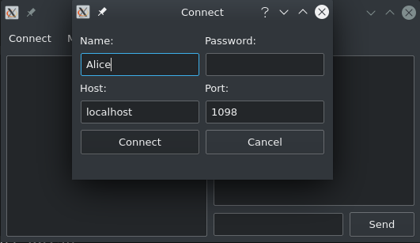
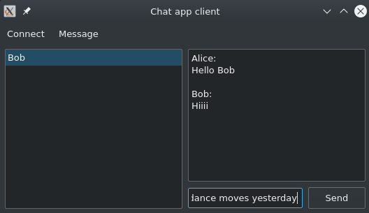

# chat_app

Simple chat application with server and client.

Self hosting server. Client is able to connect to any given server address. 

Client have simple interface and easy to understand. With Qt's environment variable a dark mode is possible.

 

# Requirements:
  1. CMake
  2. Any C++ compiler with support for C++ 17 (Tested with g++, clang++ and MinGW64 on MSYS2)
  
For Server:
  1. PostgreSQL
  2. libPQXX

For Client:
  1. SQLite3
  2. Qt5

# Building:
On linux:
  1. mkdir build
  2. cd build
  3. cmake ..
  4. make
